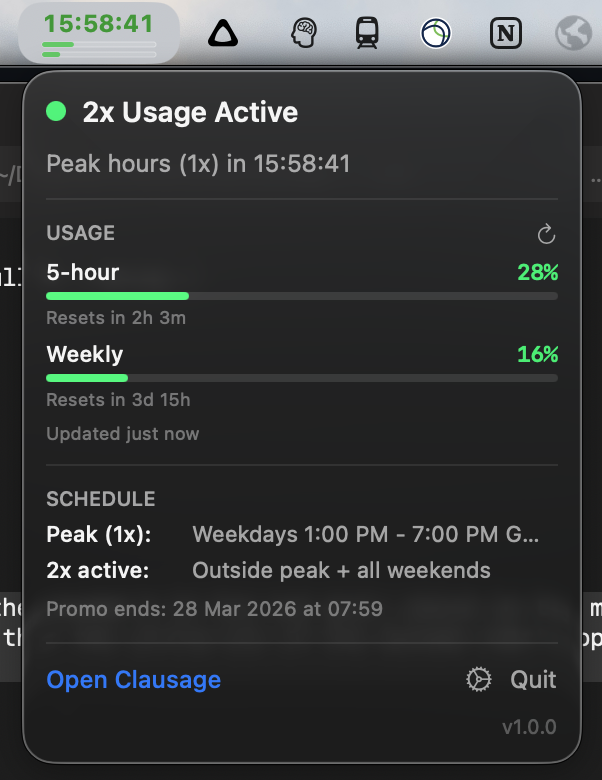
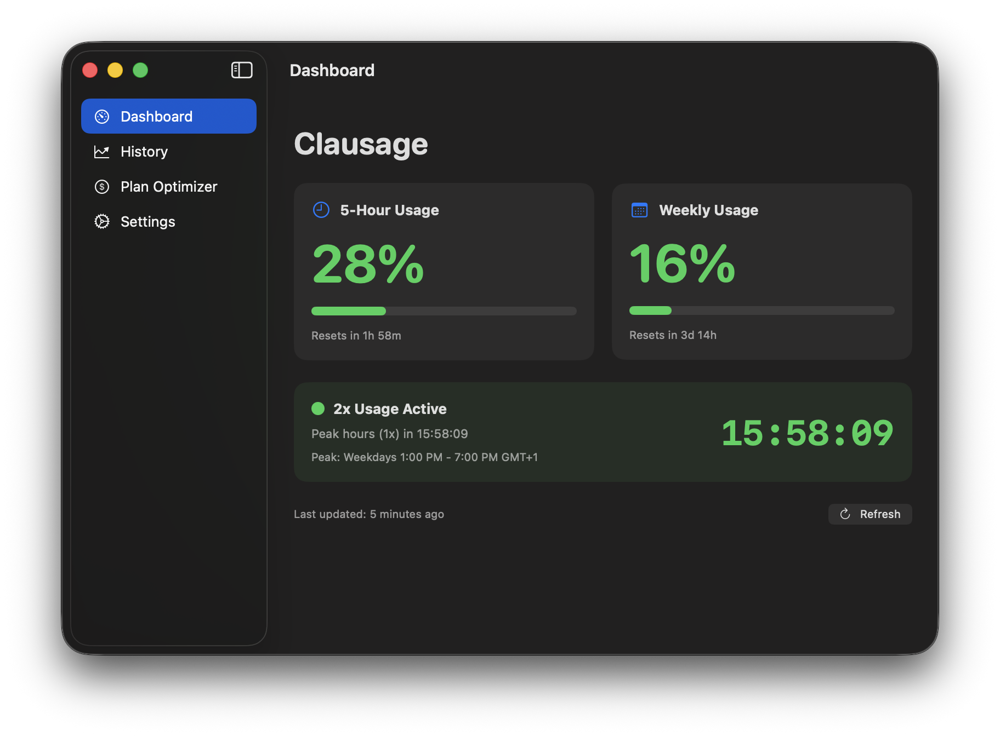
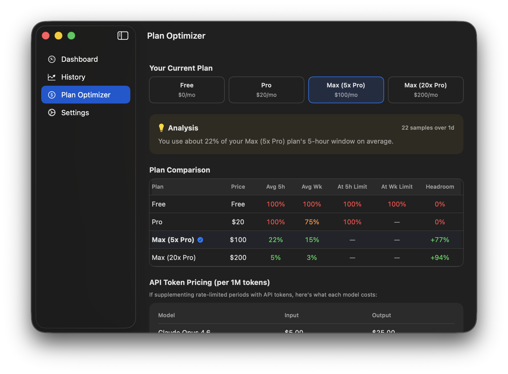

# Clausage 🌭

A native macOS app to track your [Claude](https://claude.ai) usage, visualize consumption over time, and get smart plan recommendations.

> *"Clausage"* — Claude + Usage. Also sounds like sausage 🌭 Hence the logo.

<p align="center">
  
  &nbsp;&nbsp;
  
</p>
<p align="center">
  
</p>

## Requirements

- **macOS 14.0** (Sonoma) or later
- **Claude Code** must be installed and logged in (for OAuth token)

## Installation

### Download

Grab the latest `Clausage.app.zip` from [Releases](https://github.com/mauribadnights/clausage/releases/latest).

1. Unzip `Clausage.app.zip`
2. Move `Clausage.app` to `/Applications`
3. Launch — it appears in your menu bar

### Build from Source

```bash
git clone https://github.com/mauribadnights/clausage.git
cd clausage
bash build.sh
open Clausage.app
```

Requires Xcode 15+ and Swift 5.9+.

## Features

### Menu Bar
- **Live usage display** in the menu bar with color-coded status
- **Usage bars** showing 5-hour and weekly consumption at a glance
- **Promo countdown timer** with peak/off-peak schedule awareness
- **Customizable** — timer format, colors, text shadow, toggle bars on/off

### Dashboard
- **Real-time usage cards** for 5-hour and weekly windows
- **Reset countdowns** showing when each usage window resets
- **Promo status** with countdown timer and schedule info

### Usage History
- **Automatic tracking** — usage is recorded every 5 minutes
- **Interactive charts** powered by Swift Charts
- **Time range filters** — 24h, 7d, 30d, or all time
- **Statistics** — average usage, max peaks, % of time at limit

### Plan Optimizer
- **Per-plan projection table** showing projected utilization, time at limit, and headroom for every plan
- **Natural language insights** analyzing your usage patterns and suggesting the cheapest plan that fits
- **Token pricing reference** for comparing API supplementation costs
- **Auto-updating pricing** — fetches latest pricing from GitHub, falls back to bundled data

### Quality of Life
- **One-time keychain prompt** — caches your Claude Code OAuth token so you're never prompted again
- **Auto-update** — checks for new releases hourly, one-click update
- **Dynamic dock icon** — shows in dock when the main window is open, hides when minimized to menu bar
- **Works in any timezone** — all schedules display in your local time
- **Zero dependencies** — pure Swift/SwiftUI, native macOS frameworks only

## How It Works

### Usage Tracking

Clausage reads your Claude Code OAuth token from the macOS Keychain and calls the Anthropic usage API every 5 minutes (configurable). Each data point is persisted locally via SwiftData so you can visualize trends over time.

The first time the app reads your token, macOS will show a Keychain prompt — click **Allow** (or **Always Allow**). Clausage caches the token in its own Keychain entry so you're never prompted again.

### Plan Optimizer

The Plan Optimizer projects your actual usage onto every available plan by scaling with each plan's capacity multiplier. For each plan it shows:

- **Projected average utilization** (5-hour and weekly windows)
- **% of time you'd be at the limit**
- **Headroom** remaining

It then generates a natural language insight suggesting the cheapest plan where you'd rarely hit limits, and notes when API token supplementation might be worth considering.

### Pricing Data

Plan and token pricing is bundled with the app and also fetched from this repository's `pricing.json`. This means pricing stays current without requiring an app update. If the remote fetch fails, the bundled data is used as a fallback.

## Configuration

All settings are accessible from the main window's Settings tab:

| Setting | Default | Description |
|---------|---------|-------------|
| Timer format | `1:32:42` | Choose: full, compact, labeled, or minimal |
| Usage bars | On | Show mini usage bars in the menu bar |
| Text shadow | Off | Add shadow to menu bar text |
| Promo timer | On | Show 2x promo countdown (auto-hides when promo ends) |
| Refresh interval | 5 min | How often to poll the Anthropic API |
| Current plan | Pro | Your Claude subscription (for plan projections) |
| Timer colors | Any | Full color picker for off-peak and peak colors |

Settings persist across launches via UserDefaults.

## Development

### Project Structure

```
Clausage/
├── App/                    # App entry point, shared state
├── Features/
│   ├── MenuBar/            # Menu bar popover
│   ├── Dashboard/          # Main window, usage cards
│   ├── History/            # Usage charts (Swift Charts)
│   ├── PlanOptimizer/      # Per-plan projections & insights
│   └── Settings/           # Preferences + debug tools
├── Services/
│   ├── KeychainService     # OAuth token with caching
│   ├── UsageService        # Anthropic API client + persistence
│   ├── UpdateService       # GitHub release auto-updater
│   ├── PlanPricingService  # Pricing data + projection engine
│   └── MockDataSeeder      # Debug: seed test data
├── Models/
│   ├── PromoSchedule       # Promo timer (remote-configurable)
│   ├── UsageSnapshot       # SwiftData model
│   ├── PlanTier            # Plan & token pricing models
│   └── AppSettings         # User preferences
└── Resources/
    ├── pricing.json        # Bundled pricing + promo config
    └── Assets.xcassets     # App icon
```

### Running Tests

```bash
swift test
```

80 tests covering promo schedule, timer formatting, version comparison, plan projections, usage data, and SwiftData persistence.

### Debug Mode

Debug builds (`./run-debug.sh`) include a **Debug** section in Settings with usage pattern presets (Heavy User, Light User, Moderate, Limit Hitter) to test History charts and Plan Optimizer projections.

### CI/CD

- **CI** — runs on every push and PR. Builds and runs the full test suite.
- **Release** — `./release.sh [patch|minor|major]` creates a PR to main, waits for CI, merges, tags, and triggers a GitHub Release with `Clausage.app.zip`.

### Updating Pricing

Edit `Clausage/Resources/pricing.json` and push to `main`. The app fetches this file periodically, so users get updated pricing without an app update. Set `promo.enabled` to `false` to disable the promo timer remotely.

## License

MIT
